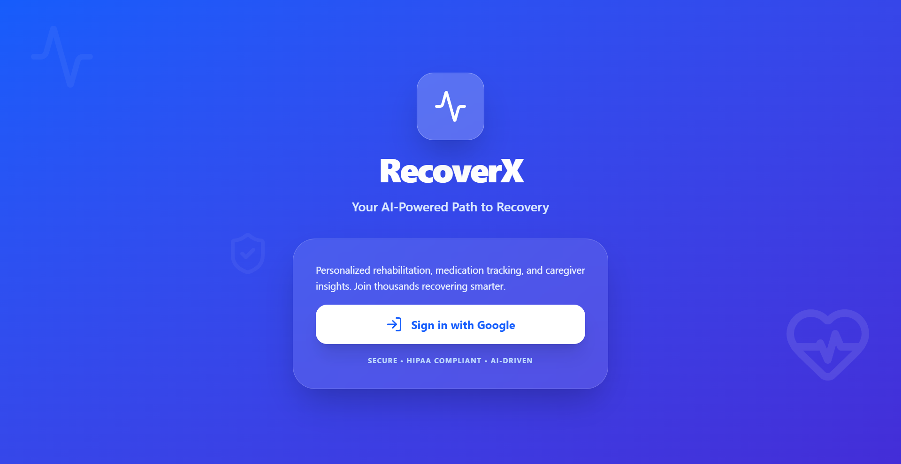
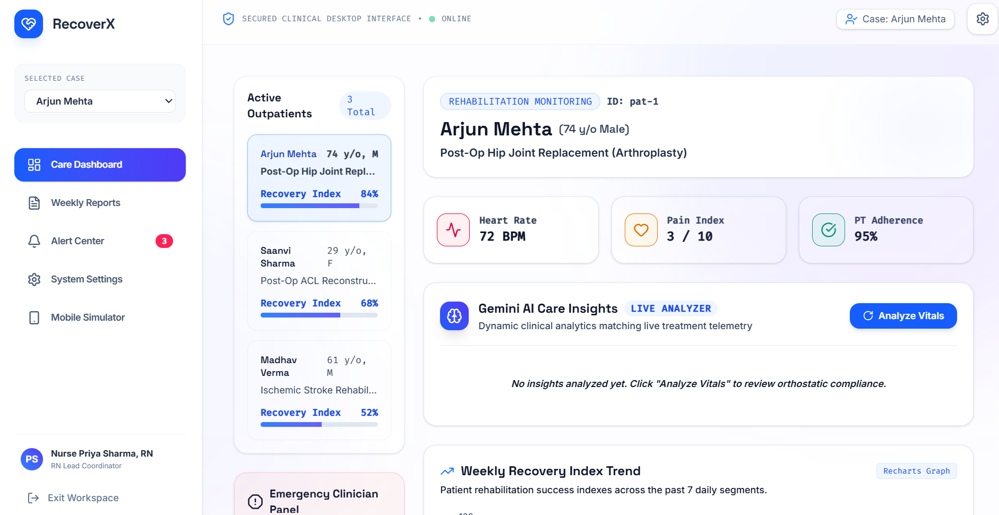
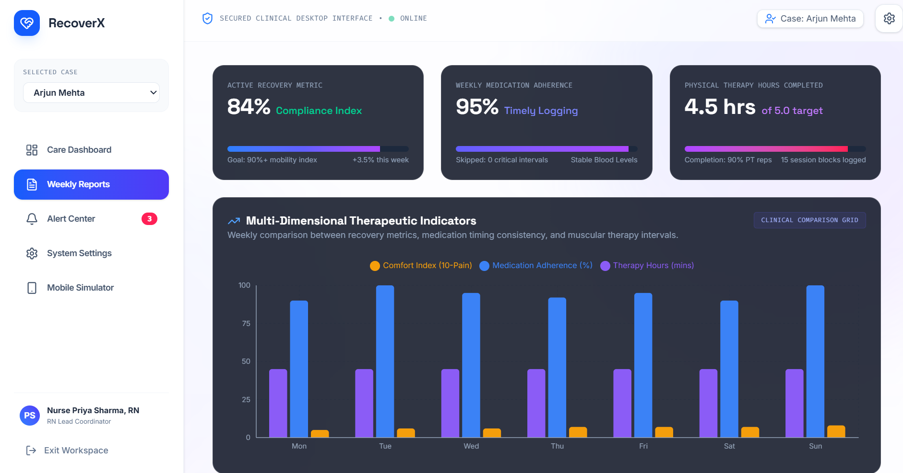
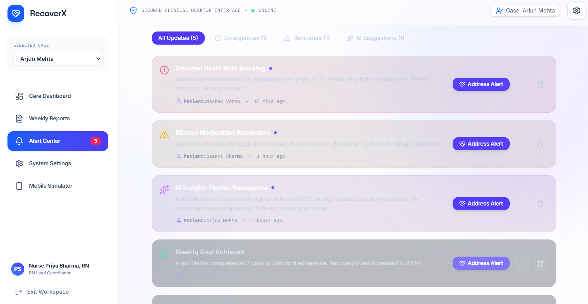
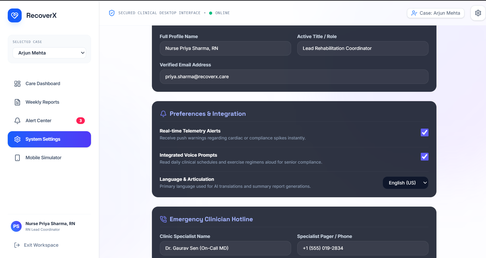
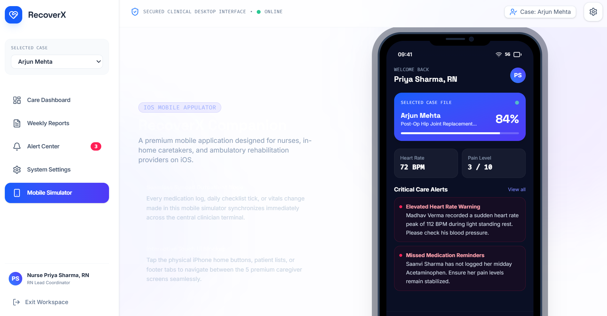
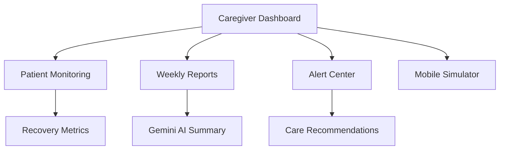

# RecoverX Caregiver

AI-powered caregiver dashboard for rehabilitation monitoring, clinical reports, medication tracking, patient alerts, and Gemini-powered recovery insights.

RecoverX Caregiver is a clinical-style web dashboard designed for nurses, in-home caregivers, and rehabilitation coordinators to monitor outpatient recovery progress from one workspace.

### Landing Page


---

## Overview

RecoverX Caregiver helps caregivers track patient recovery after surgery or rehabilitation by combining structured health data, weekly reports, alerts, treatment tasks, and AI-generated care insights.

The platform focuses on:

- Patient recovery monitoring
- Medication and treatment adherence
- Weekly rehabilitation reports
- AI clinical summaries
- Caregiver alert workflows
- Mobile caregiver simulation

---

## Problem

Caregivers often manage recovery updates across disconnected notes, medication logs, appointments, and patient communication. This makes it difficult to quickly understand whether a patient is improving, missing medication, or showing early signs of risk.

---

## Solution

RecoverX Caregiver provides a centralized dashboard where caregivers can view patient status, track rehabilitation progress, review weekly metrics, respond to alerts, and use Gemini-powered insights to support care decisions.

---

## Key Features

- Care dashboard for active outpatient monitoring
- Patient recovery score, heart rate, pain index, and therapy adherence tracking
- Medication protocol and treatment plan management
- Weekly rehabilitation reports with clinical-style metrics
- Gemini AI care insights and recovery summaries
- Alert center for missed medication, critical updates, and AI suggestions
- Interactive mobile simulator for caregiver-side patient monitoring
- System settings for caregiver profile, preferences, and notification configuration

---

## Tech Stack

| Layer | Technology |
|---|---|
| Frontend | React, TypeScript |
| Build Tool | Vite |
| Backend Runtime | Node.js, TSX |
| AI Integration | Gemini API |
| Styling | CSS / responsive UI components |
| Development | Google AI Studio, GitHub |

---
## Screenshots

### Care Dashboard


### Weekly Reports


### Alert Center


### System Settings


### Mobile Simulator


## Architecture



## Project Structure

```text
recover-x-caregiver/
├── src/
├── images/
├── index.html
├── server.ts
├── package.json
├── package-lock.json
├── vite.config.ts
├── tsconfig.json
├── metadata.json
├── .env.example
├── .gitignore
└── README.md
```

---

## Getting Started

### 1. Clone the repository

```bash
git clone https://github.com/PoojaSiv0211/RecoverX-CareGiver.git
cd RecoverX-CareGiver
```

### 2. Install dependencies

```bash
npm install
```

### 3. Add environment variables

Create a `.env` file in the root folder:

```env
GEMINI_API_KEY=your_gemini_api_key_here
```

### 4. Run the project

```bash
npm run dev
```

Open the app at:

```text
http://localhost:3000
```

## Disclaimer

This project is a portfolio prototype using demo clinical data. It is not a medical device and should not be used for real diagnosis, treatment, or emergency care.

## Author

Pooja S

AI & Data Science Undergraduate
