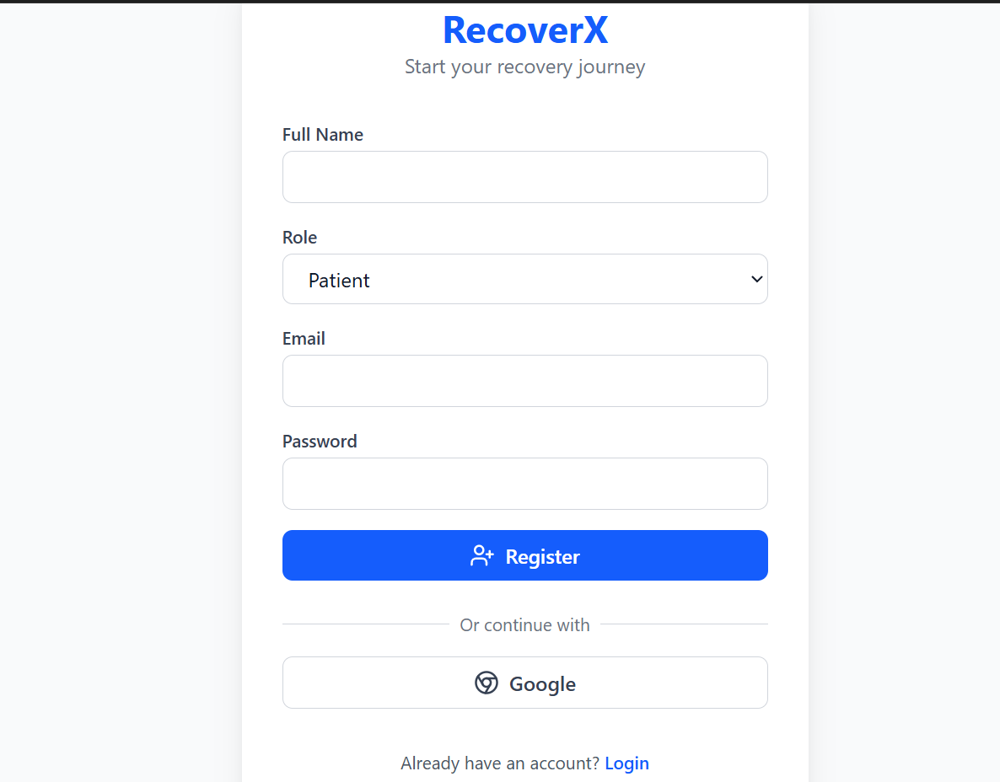
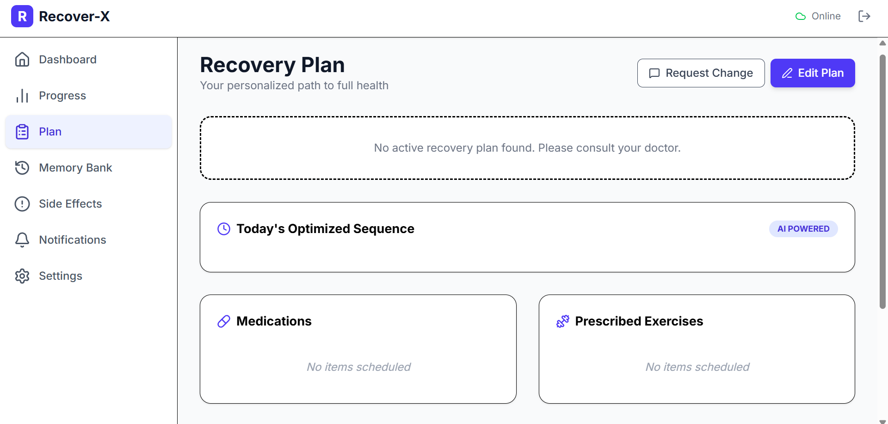
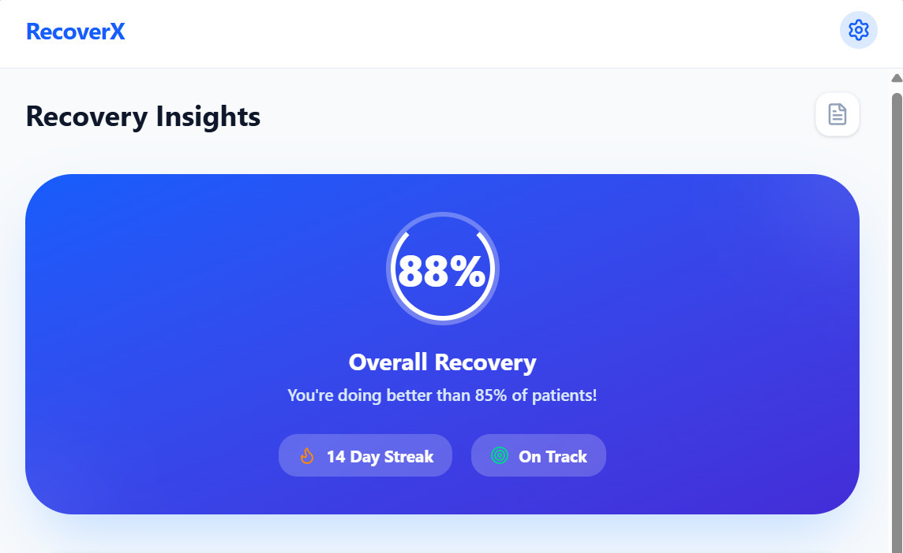
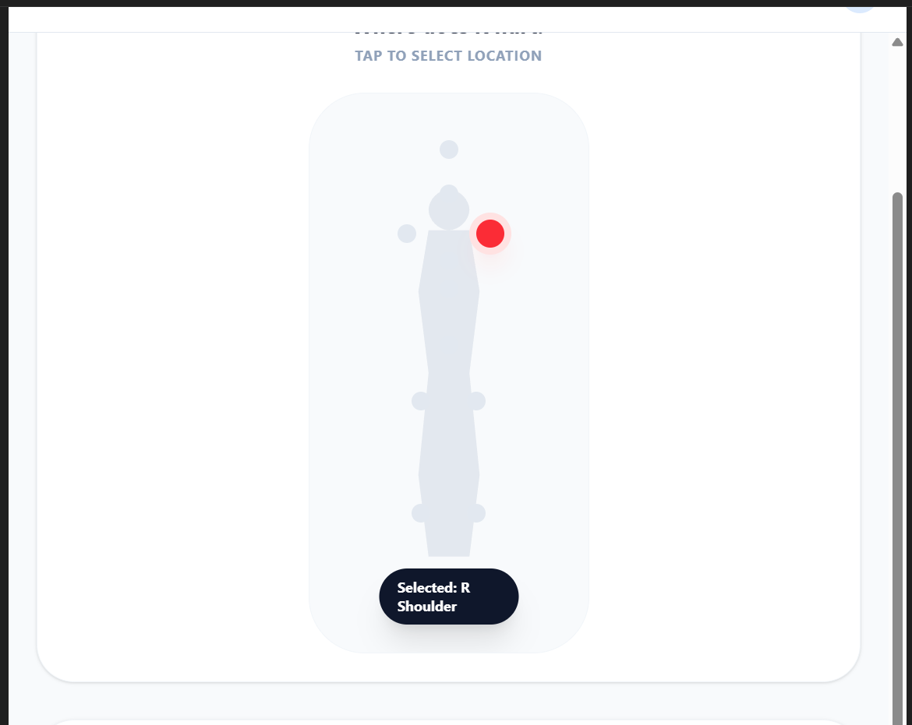
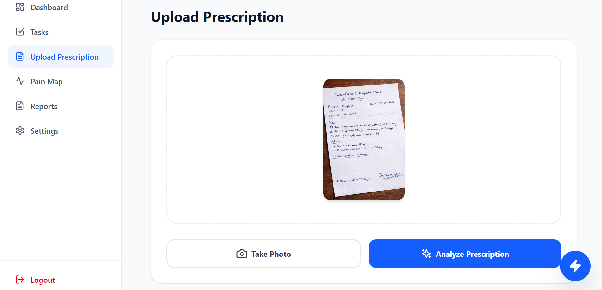
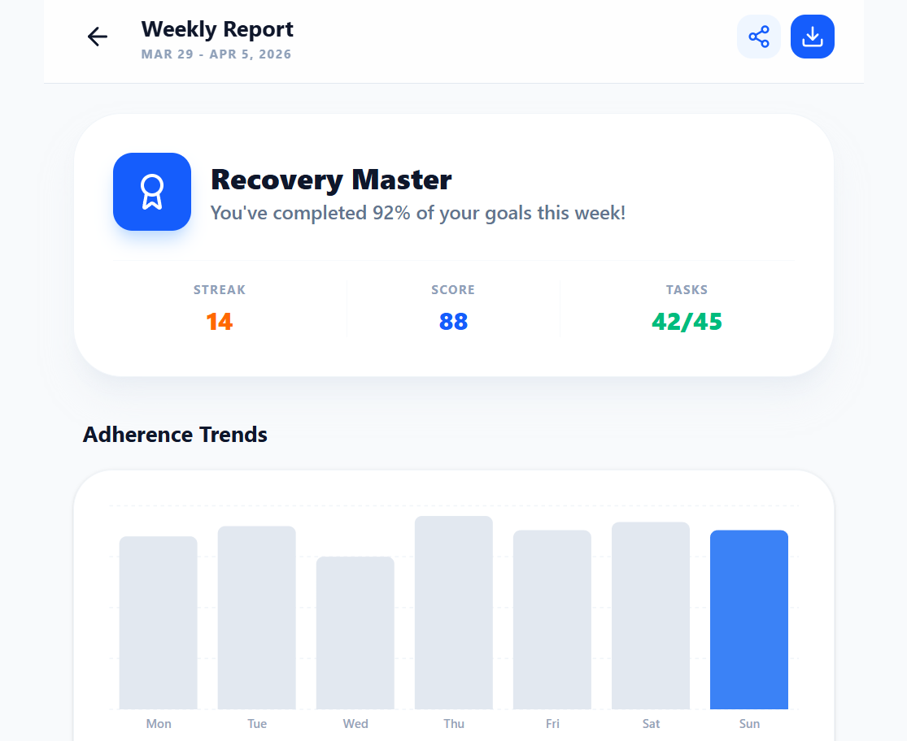
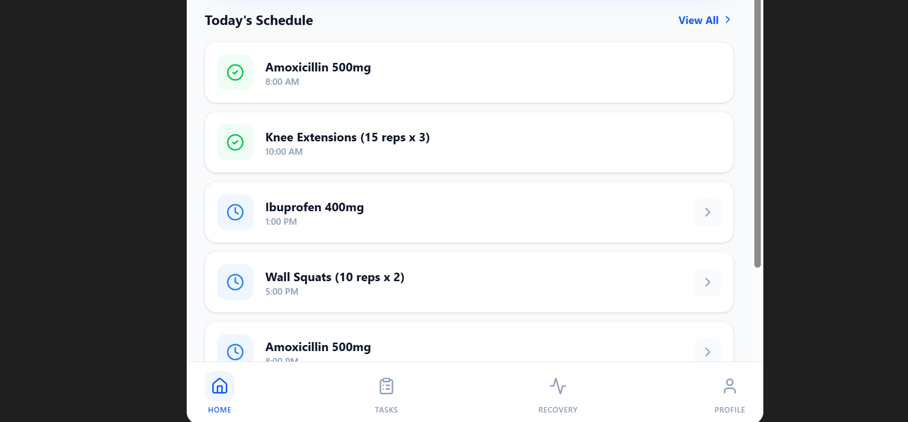

<h1 align="center">RecoverX</h1>

<p align="center">
<b>AI-Powered Healthcare & Recovery Management Platform</b>
</p>

<p align="center">
Helping patients and caregivers manage rehabilitation through AI-generated recovery plans, medication reminders, prescription analysis, progress tracking, multilingual voice navigation, and recovery insights.
</p>

<p align="center">


</p>

---

<p align="center">

</p>

---

# Features

- AI Prescription Analysis
- Personalized Recovery Plans
- Medication & Exercise Scheduling
- Interactive Pain Mapping
- Recovery Progress Dashboard
- Weekly Recovery Reports
- Google Authentication
- Firebase Cloud Database
- Multilingual Voice Navigation
- AI Behaviour Insights
- Caregiver Support Dashboard

---

# Tech Stack

### Frontend

- React
- TypeScript
- Vite
- Tailwind CSS

### Backend

- Firebase Authentication
- Firestore Database
- Firebase Storage

### AI

- Google Gemini API

### Additional Technologies

- Google Text-to-Speech
- HTML
- CSS
- JavaScript

---

# Architecture

```
               User
                 │
                 ▼
        React + TypeScript
                 │
                 ▼
      Firebase Authentication
                 │
                 ▼
        Firestore Database
                 │
      ┌──────────┴──────────┐
      ▼                     ▼
Gemini AI            Voice Navigation
      │                     │
      └──────────┬──────────┘
                 ▼
        Personalized Recovery
```

---

# Screenshots

## Login Page

<p align="center">

</p>

---

## Dashboard

<p align="center">

</p>

---

## Recovery Plan

<p align="center">

</p>

---

## AI Recovery Insights

<p align="center">

</p>

---

## Pain Mapping

<p align="center">

</p>

---

## Upload Prescription

<p align="center">

</p>

---

## Weekly Recovery Report

<p align="center">

</p>

---

## Daily Schedule

<p align="center">

</p>

---

## Settings & Voice Navigation

<p align="center">

</p>

---

# Installation

Clone the repository

```bash
git clone https://github.com/PoojaSiv0211/RecoverX-CareGiver.git
```

Move into the project

```bash
cd RecoverX-CareGiver
```

Install dependencies

```bash
npm install
```

Start the development server

```bash
npm run dev
```

---

# Project Structure

```
RecoverX-CareGiver/
│
├── images/
├── src/
├── public/
├── firebase/
├── package.json
├── vite.config.ts
└── README.md
```

---

# Future Enhancements

- Doctor Portal
- Hospital Dashboard
- Smart Wearable Integration
- Telemedicine Support
- AI Chat Assistant
- Offline Functionality
- Appointment Scheduling
- Medicine Reminder Notifications
- PDF Report Generation

---

# Why RecoverX?

RecoverX is designed to simplify rehabilitation by combining Artificial Intelligence, cloud technologies, and modern web development. It enables patients to stay on track with recovery while providing caregivers with intelligent insights, medication management, progress reports, and multilingual accessibility.

---

# Author

### Pooja Sivaramalingam

B.Tech Artificial Intelligence & Data Science

Coimbatore Institute of Technology

GitHub: https://github.com/PoojaSiv0211

---

<p align="center">
Made with ❤️ using React, Firebase & Gemini AI
</p>
